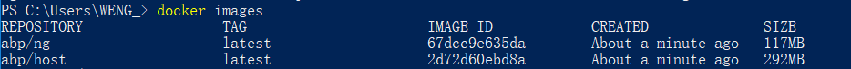
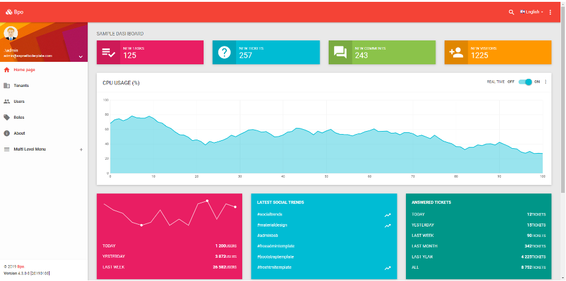

# abp官方demo发布至云服务器

## 准备

- 从abp官网下载最新demo，选择.NETCore + Angular模版
- docker for windows
- 安装sqlserver数据库

## 在云服务器安装sqlserver数据库

### 创建user-defined network

首先我们在服务器上创建一个user-defined network，输入以下命令：

```bash
sudo docker network create abp_net
```

检查是否创建成功：

```bash
sudo docker network list
```


### 安装数据库

依次输入以下命令：

- ```bash
    sudo docker pull mcr.microsoft.com/mssql/server:2017-latest
  ```

- ```bash
   sudo docker run -e 'ACCEPT_EULA=Y' -e 'SA_PASSWORD=yourpassword' \
      -p 1433:1433 --network abp_net --name abp_db \
      -d mcr.microsoft.com/mssql/server:2017-latest
  ```

### 初始化数据库

1. 打开上面下载的解决方案，修改Host项目下的appsettings.json文件，修改连接串以连接到云服务器的数据库；
2. 在visual studio程序包管理控制台窗口中选择EntityFrameworkCore项目，然后输入命令`update-database`完成数据库的初始化。

>注意：
>1. 为了本地能够连接数据库，请现在云服务器控制台添开放1043端口；初始化完成后，可以关闭该端口。
>2. `update-database`出错时，可以先`add-migration`，然后再`update-database`。

## 创建项目镜像文件

### 项目文件修改

#### Host项目

修改Host项目的appsettings.Staging.json文件

```xml
{
    "ConnectionStrings": {
        "Default": "Server=abp_db; Database=AbpDB; User=sa; Password=yourpassword;"
    },
    "App": {
        "WebSiteRootAddress": "http://47.98.223.251:9902",
        "CorsOrigins": "http://47.98.223.251:9902"
    }
}
```

> 其中abp_db为上面我们创建的数据库容器名

#### Angular项目

修改appconfig.production.json文件

```xml
{
    "remoteServiceBaseUrl": "http://47.98.223.251:9901",
    "appBaseUrl": "http://47.98.223.251:9902",
}
```

### 创建镜像文件

找到文件：aspnet-core\build\build-with-ng.ps1，直接运行即可。

> 注意：  
> 1. 查看文件build-with-ng.ps1，需将 `ng build -prod` 命令改成 `ng build --prod`
> 2. 首次运行脚本文件时建议在文件最后加上`pause`，在脚本运行完成时检查窗口，确认是否存在任何可能的错误。

在确认正确运行结束后，可以查看刚刚创建的两个镜像。



### 上传镜像至docker hub

首先在自己的docker hub中创建两个仓储：abp-host和abp-ng，然后依次输入以下命令完成推送。

```bash
dokcer tag 67dcc9e635da wenwengxk/abp-ng:1.0
```

```bash
docker tag 2d72d60ebd8a wenwengxk/abp-host:1.0
```

```bash
docker push wenwengxk/abp-ng:1.0
```

```bash
docker push wenwengxk/abp-host:1.0
```

## 在云服务器中创建容器

依次输入以下命令完成创建容器。

```bash
sudo docker pull wenwengxk/abp-ng:1.0
```

```bash
sudo docker pull wenwengxk/abp-host:1.0
```

```bash
sudo docker run -itd --name abp_host --network abp_net -p 9901:80 \
    --env ASPNETCORE_ENVIRONMENT=Staging wenwengxk/abp-host:1.0
```

```bash
sudo docker run -itd --name abp_ng --network abp_net \
    -p 9902:80 wenwengxk/abp-ng:1.0
```

>可以创建docker-compose文件，集中管理服务

## 最后

