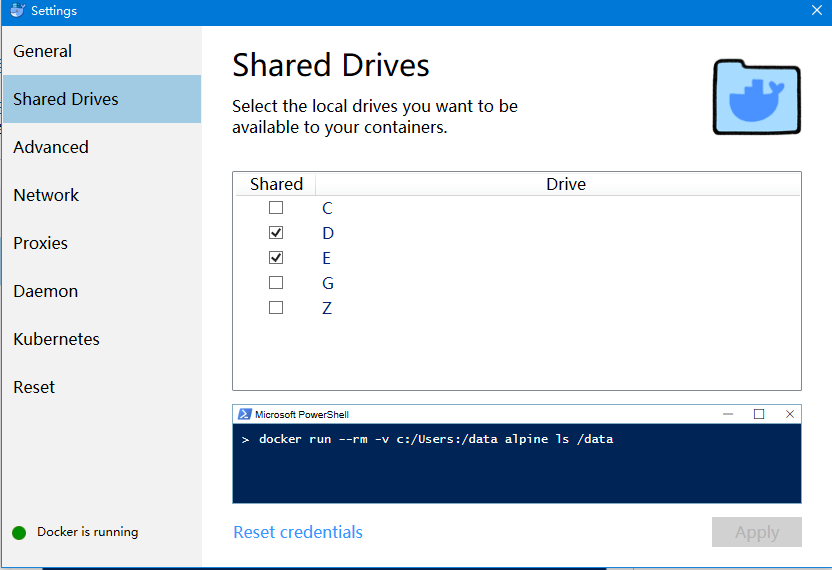
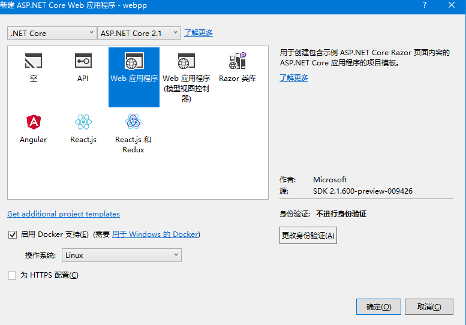
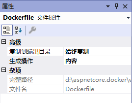
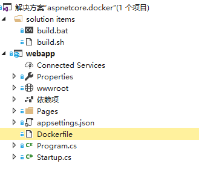
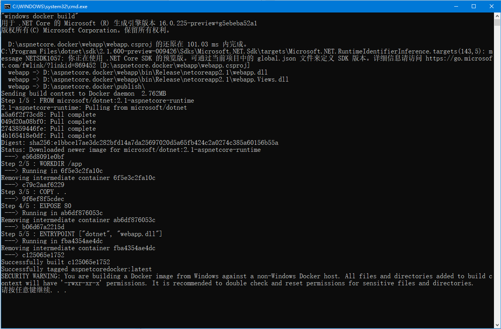
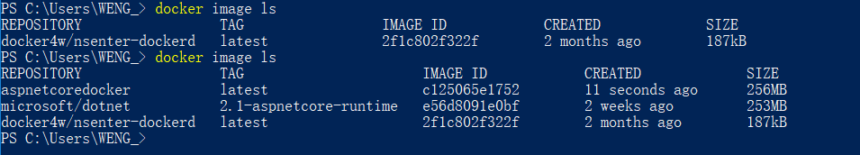
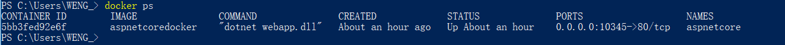
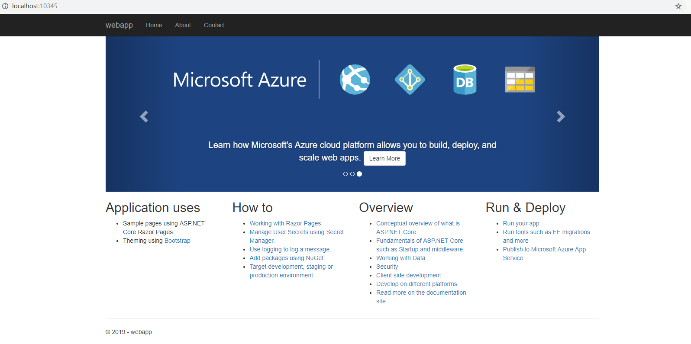

# 部署 aspnetcore 程序至 docker

## 系统必备

- 启用hyper-v
- [docker for windows](https://docs.docker.com/docker-for-windows/install/)
- vs2017

## docker 基本设置

- 共享驱动器  

  

- 登录 docker  
  > 如果用email登陆docker，在后面build镜像时会提示unauthorized，这时需要退出重新用docker id来登陆，可以在powershell界面输入`docker logout` 回车，然后再输入`docker login` , 根据提示输入用户名和密码登陆。

## 项目准备

1. 创建空白解决方案aspnetcore.docker，添加web项目webapp，勾选docker支持，vs会自动创建dockerfile文件。

  

2. 注释掉默认的dockerfile文件内容（可以尝试用默认的dockerfile文件build镜像），添加如下命令：

```code
FROM microsoft/dotnet:2.1-aspnetcore-runtime
WORKDIR /app
COPY . .
EXPOSE 80
ENTRYPOINT ["dotnet", "webapp.dll"]
```

3. 设置dockerfile文件属性



4. 编写 publish&build 的脚本文件

编写build.bat文件

- windows

```code
@echo off

echo "windows docker build"

dotnet publish -c Release -o ../publish

cd ./publish

docker build -t aspnetcoredocker .

pause
```
 
- linux  
  如果是linux开发环境，则需要用linux对应的脚本

经过以上步骤，整体解决方案文件结构如下



## 构建镜像

1. 先在powershell界面输入`docker image ls` ,  此时只有一个镜像文件

2. 执行build.bat文件
   

3. 再次在powershell界面输入`docker image ls`  
   

## 创建容器

  以上我们创建了镜像文件，然后就可以根据镜像来创建容器，并保持后台运行。执行以下命令  
  > `docker run --name aspnetcore -p 10345:80 -d aspnetcoredocker`

  执行以下命令`docker ps` ，检查正在运行的docker容器
   

  在浏览器输入 http://localhost:10345/ ，即可访问发布的web程序，同时可以看到控制台的日志输出信息

  

  attach到容器，输入以下命令`docker attach aspnetcore` ，可以看到web程序的控制台日志输出信息

>下一篇：[将本地镜像部署到阿里云](/docs/docker/02.md)

## 参阅

- [https://yq.aliyun.com/articles/602962](https://yq.aliyun.com/articles/602962)
- [https://docs.microsoft.com/zh-cn/aspnet/core/host-and-deploy/docker/visual-studio-tools-for-docker?view=aspnetcore-2.2](https://docs.microsoft.com/zh-cn/aspnet/core/host-and-deploy/docker/visual-studio-tools-for-docker?view=aspnetcore-2.2)