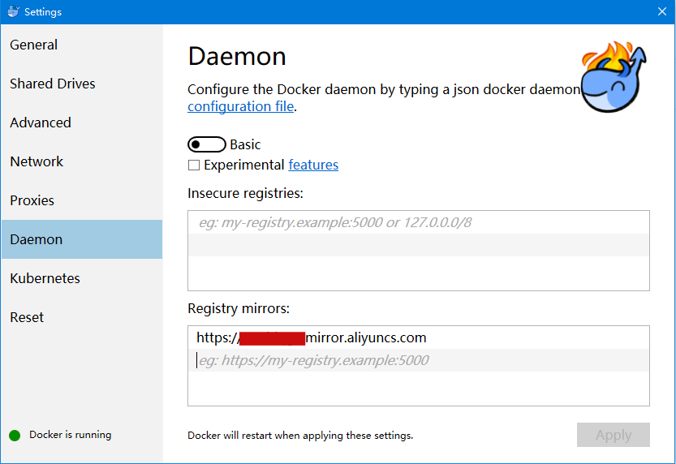

# 将docker镜像部署到阿里云

>上一篇：[部署 aspnetcore 程序至 docker](/docs/docker/01.md)

在上篇中我们创建了本地镜像，并且成功运行相应的容器。接下来，我们将本地镜像部署到阿里云服务器，在云服务器上运行应用。

## 准备

1. 在 hub.docker.com 中创建自己的镜像库，命名demo
2. 登陆阿里云服务器，打开控制台/容器镜像服务/镜像加速器，复制自己的镜像加速地址，打开docker for windows的setting界面，复制添加到daemon/registry mirrors栏目下。




## 推送镜像到docker hub

推送镜像之前，一般需要将镜像添加明确的标签。在实际运作中，每一次测试发布或者是部署到生产环境中都需要有唯一的标签，而不是延用latest。

docker tag:

```code
docker tag c125065e1752 wenwengxk/demo:original
```

docker push:

```code
docker push wenwengxk/demo:original
```


成功push后，可以在自己的docker hub存储库中看到刚推送的镜像。


## 在阿里云服务器中获取镜像并创建容器

1. 登陆阿里云服务器，获取上述刚推送的镜像


2. 创建容器


3. 配置安全组规则


4. 配置完成后，可以在自己的浏览器中成功访问


## 参阅

- [https://ropenscilabs.github.io/r-docker-tutorial/04-Dockerhub.html](https://ropenscilabs.github.io/r-docker-tutorial/04-Dockerhub.html)