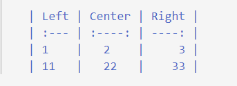

# Markdown 介绍

## 引言

Markdown是一种轻量级标记语言，它使得人们更加容易创作和阅读文档。  

参阅：  

- [https://www.markdownguide.org/](https://www.markdownguide.org/)
- [https://markdown-zh.readthedocs.io/en/latest/](https://markdown-zh.readthedocs.io/en/latest/)
- [http://www.cirosantilli.com/markdown-style-guide/](http://www.cirosantilli.com/markdown-style-guide/)
- [http://einverne.github.io/markdown-style-guide/zh.html](http://einverne.github.io/markdown-style-guide/zh.html)

## 基础语法

1. 标题  

    <p>
    # 一级标题<br/>
    ## 二级标题<br/>
    ### 三级标题<br/>
    #### 四级标题<br/>
    ##### 五级标题<br/>
    ###### 六级标题
    </p>

2. 换行  

    行尾加两个空格然后回车或直接两个回车

3. 粗/斜体

    粗体：  
    <p>
    **Coding，让开发更简单**<br/>
    __Coding，让开发更简单__
    </p>
    斜体：
    <p>
    *Coding，让开发更简单*<br/>
    _Coding，让开发更简单_
    </p>

4. 块引用
    <p>
    > 这是第一级引用<br/>
    >> 这是第二级引用<br/>
    >>> 这是第三级引用<br/>
    ><br/>
    > 回到第一级引用
    </p>

5. 列表
    <p>
    - red<br/>
    - green<br/>
    - blue<br/>
    <br/>
    1. red<br/>
    2. green<br/>
    3. blue<br/>
    </p>

6. 代码
    <p>
    ```csharp<br/>
    Order GetOrder(string orderNo)<br/>
    {<br/>
    &nbsp;&nbsp;&nbsp;&nbsp;return  _orderRepository.Find(orderNo);<br/>
    }
    ```
    </p>

7. 链接
    <p>
    [welcome to google](http://google.com)
    </p>

8. 图片
    <p>
    
    </p>

9. 表格

 

## Markdown with VS Code

参阅：

- [https://code.visualstudio.com/docs/languages/markdown](https://code.visualstudio.com/docs/languages/markdown)

- [https://mermaidjs.github.io/](https://mermaidjs.github.io/)

在vscode应用商店安装：  

1. Markdown All in One
2. markdownlint
3. Mermaid Preview
